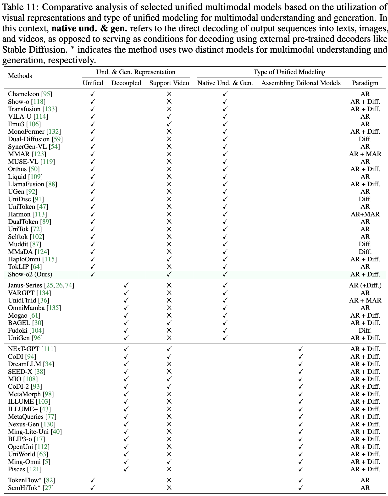
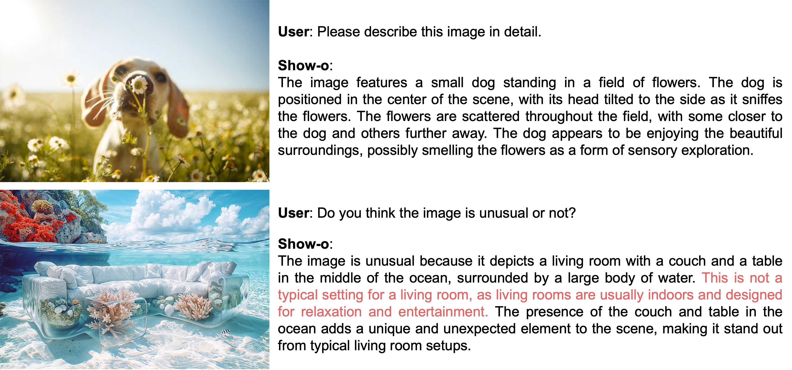

<div align="center">
<br>

<h3>One Single Transformer to Unify Multimodal Understanding and Generation</h3>

[Jinheng Xie](https://sierkinhane.github.io/)<sup>1&#42;</sup>&nbsp;
[Weijia Mao](https://scholar.google.com/citations?hl=zh-CN&user=S7bGBmkyNtEC&view_op=list_works&sortby=pubdate)<sup>1&#42;</sup>&nbsp;
[Zechen Bai](https://www.baizechen.site/)<sup>1&#42;</sup>&nbsp;
[David Junhao Zhang](https://junhaozhang98.github.io/)<sup>1&#42;</sup>&nbsp;
<br>
Weihao Wang<sup>2</sup>&nbsp;
[Kevin Qinghong Lin](https://qinghonglin.github.io/)<sup>1</sup>&nbsp;
[Yuchao Gu](https://ycgu.site/)<sup>1</sup>
Zhijie Chen<sup>2</sup>&nbsp;
[Zhenheng Yang](https://scholar.google.com/citations?user=Ds5wwRoAAAAJ&hl=en)<sup>2</sup>&nbsp;
[Mike Zheng Shou](https://sites.google.com/view/showlab)<sup>1</sup> 

<sup>1</sup> [Show Lab](https://sites.google.com/view/showlab/home?authuser=0), National University of Singapore&nbsp; <sup>2</sup> Bytedance&nbsp;
 
[](https://openreview.net/pdf?id=o6Ynz6OIQ6) [](https://arxiv.org/pdf/2408.12528) [](https://huggingface.co/spaces/showlab/Show-o) [](https://discord.gg/p6k7XupM) [](https://github.com/showlab/Show-o/blob/main/docs/wechat_qa_3.jpg) 
</div>

[//]: # ([![Hits]&#40;https://hits.seeyoufarm.com/api/count/incr/badge.svg?url=https%3A%2F%2Fgithub.com%2Fshowlab%2FShow-o&count_bg=%234DC621&title_bg=%23811AD2&icon=&icon_color=%23E7E7E7&title=hits&edge_flat=false&#41;]&#40;https://hits.seeyoufarm.com&#41;)
<div align="center">
<br>


<h3>Improved Native Unified Multimodal Models</h3>

[Jinheng Xie](https://sierkinhane.github.io/)<sup>1</sup>&nbsp;
[Zhenheng Yang](https://scholar.google.com/citations?user=Ds5wwRoAAAAJ&hl=en)<sup>2</sup>&nbsp;
[Mike Zheng Shou](https://sites.google.com/view/showlab)<sup>1</sup> 

<sup>1</sup> [Show Lab](https://sites.google.com/view/showlab/home?authuser=0), National University of Singapore&nbsp; <sup>2</sup> Bytedance&nbsp;
 
[](https://arxiv.org/abs/2506.15564) [](https://github.com/showlab/Show-o/tree/main/show-o2) [](https://github.com/showlab/Show-o/blob/main/docs/wechat_qa_3.jpg) 
</div>


## News
* **[2025-09-18]** [Arxiv update](https://arxiv.org/pdf/2506.15564) to include video understanding, OneIG, and more ablation study results.
* **[2025-09-18]** **Show-o2 has been accepted to NeurIPS 2025.**
* **[2025-09-05]** Release the 1.5B and 7B models with video understanding capability.
* **[2025-07-05]** **Fix some issues related to visualization of generated images during training.**
* **[2025-07-05]** We release the training and inference code for simple mixed-modality generation.
* **[2025-06-27]** We release the training code for multimodal understanding and generation.
* **[2025-06-25]** We thank team [OneIG-Bench](https://github.com/OneIG-Bench/OneIG-Benchmark) for evaluating Show-o2 models on their new benchmark, in which our models have achieved leading performance in terms of Alignment and Reasoning metrics. The leaderboard is maintained [here](https://oneig-bench.github.io/).


* **[2025-06-20]** We are including more concurrent works in our [comparative analysis tables](https://github.com/showlab/Show-o/blob/main/show-o2/docs/comparative_analysis.png). Feel free to reach out to us if we miss your works.

[//]: # ()
* **[2025-06-19]** We release the [**Show-o2**](https://github.com/showlab/Show-o/tree/main/show-o2) models **with 1.5B and 7B LLM parameters** for multimodal understanding and generation.
We perform the unified learning of multimodal understanding and generation on the text token and **3D Causal VAE space**, which is scalable for **text, image, and video modalities**. A dual-path of spatial (-temporal) fusion is proposed to accommodate the distinct feature dependency  of multimodal understanding and generation. We employ specific heads with **autoregressive modeling and flow matching** for the overall unified learning of **multimodal understanding, image/video and mixed-modality generation.**

<br/>


<table style="width:100%;">
  <tr>
    <td style="width:50%;">
      
    </td>
    <td style="width:50%;">
      
    </td>
  </tr>
</table>

<table style="width:100%;">
  <tr>
    <td style="width:25%;">
      
    </td>
    <td style="width:25%;">
      
    </td>
    <td style="width:25%;">
      
    </td>
    <td style="width:25%;">
      
    </td>
  </tr>
</table>

* **[2025-01-23]** **Show-o has been accepted to ICLR 2025.**
* **[2024-10-15]** Update Arxiv paper to include new features and experimental results.
  * Support image generation in a resolution of 512x512.
  <p align="center"> </p>
  
  * Improve the multimodal understanding capabilities of purely discrete Show-o.
  <p align="center"> </p>
  
  * Improve the performance on the GenEval benchmark.
  <p align="center"> </p>
  
  * Explore the impact of dataset scale and image resolution on multimodal understanding capabilities of discrete image tokens. For more information, please refer to the paper.
  <p align="center"> </p>
  
  * We release [the weight of Show-o](https://huggingface.co/showlab/show-o-512x512-wo-llava-tuning) before fine-tuning on LLaVA instructional tuning datasets. You can fine-tune it following the configurations in `./configs`.
  

* **[2024-09-12]** Arxiv paper updated to include preliminaries about discrete diffusion.
* **[2024-09-03]** We deploy an online demo on [Hugging Face Space](https://huggingface.co/spaces/showlab/Show-o). 🤗 Have fun!
* **[2024-09-02]** **We release the training code for pre-training and instruction tuning!** 🔥🔥
* **[2024-09-01]** Add [FlexAttention implementation](https://github.com/showlab/Show-o/blob/main/training/omni_attention.py) for accleration. Thanks to [@Horace](https://github.com/Chillee) for providing examples.
* **[2024-08-28]** We maintain a repo of [Awesome Unified Multimodal Models](https://github.com/showlab/Awesome-Unified-Multimodal-Models). If you are interested in unified models, star and watch it to get latest updates!
* **[2024-08-27]** Add integration to Hugging Face! Thanks to @[NielsRogge](https://github.com/NielsRogge).
* **[2024-08-26]** We build two community platforms to facilitate discussion, request and collaboration! Reach us with [Discord](https://discord.gg/p6k7XupM) and [WeChat](https://github.com/showlab/Show-o/blob/main/docs/wechat_qa_3.jpg)!
* **[2024-08-23]** We release the inference code of Show-o (**1.3B**) for multimodal understanding and generation including image captioning, visual question answering (VQA), text-to-image generation, text-guided inpainting and extrapolation.

## What is the new about Show-o?
Below is a characteristics comparison among understanding only, generation only, and unified (understanding \& generation) models. `Vision` and `Language` indicate the representations from specific input modalities. **In this context, `Diffusion` represents both continuous and discrete diffusion.**
<p align="center">

</p>

Below is an overview of **Show-o**. The input data, regardless of its modalities, is tokenized and then prompted into a formatted input sequence. Show-o processes text tokens autoregressively with causal attention and image tokens in (discrete) denoising diffusion modeling via full attention, and then generates the desired output. Specifically, Show-o is capable of handling image captioning, visual question answering, text-to-image generation, text-guided inpainting/extrapolation, and mixed modality generation.


<br/>

## TODO
- [X] Release the inference code.
- [X] Release the training code.
- [X] Support image generation in a resolution of 512x512.
- [ ] Scale up the model size (based on LLaMA3) and increase the number of training data.

## Hugging Face models and annotations
The Show-o2 checkpoints can be found on Hugging Face:
* [showlab/show-o2-1.5B](https://huggingface.co/showlab/show-o2-1.5B)
* [showlab/show-o2-1.5B-HQ](https://huggingface.co/showlab/show-o2-1.5B-HQ) (text-to-image generation in resolutions of 512x512 and 1024x1024 with better text rendering)
* [showlab/show-o2-7B](https://huggingface.co/showlab/show-o2-7B)
* [showlab/show-o2-1.5B](https://huggingface.co/showlab/show-o2-1.5B-w-video-und) (further unified fine-tuning on video understanding data)
* [showlab/show-o2-7B](https://huggingface.co/showlab/show-o2-7B-w-video-und) (further unified fine-tuning on video understanding data)

The Show-o checkpoints can be found on [Hugging Face](https://huggingface.co/showlab):
* [showlab/show-o-512x512](https://huggingface.co/showlab/show-o-512x512)
* [showlab/show-o-w-clip-vit-512x512](https://huggingface.co/showlab/show-o-w-clip-vit-512x512)
* [showlab/show-o-512x512-wo-llava-tuning](https://huggingface.co/showlab/show-o-512x512-wo-llava-tuning)
* [showlab/show-o](https://huggingface.co/showlab/show-o)
* [showlab/show-o-w-clip-vit](https://huggingface.co/showlab/show-o-w-clip-vit)
* [showlab/magvitv2](https://huggingface.co/showlab/magvitv2)
* [Journeydb-Annotation](https://huggingface.co/datasets/Sierkinhane/JourneyDB-Annotations )

## Getting Started
First, set up the environment:
```
pip3 install -r requirements.txt
```
Login your wandb account on your machine or server.
```
wandb login <your wandb keys>
```
Inference demo for **Multimodal Understanding** and you can view the results on wandb.
```
option (c)

python3 inference_mmu.py config=configs/showo_demo_w_clip_vit_512x512.yaml \
max_new_tokens=100 \
mmu_image_root=./mmu_validation question='Please describe this image in detail. *** Do you think the image is unusual or not?'

or option (a)

python3 inference_mmu.py config=configs/showo_demo_512x512.yaml \
max_new_tokens=100 \
mmu_image_root=./mmu_validation question='Please describe this image in detail. *** Do you think the image is unusual or not?'
```


Inference demo for **Text-to-Image Generation** and you can view the results (in a resolution of 512x512) on wandb.
```
python3 inference_t2i.py config=configs/showo_demo_512x512.yaml \
batch_size=1 validation_prompts_file=validation_prompts/showoprompts.txt \
guidance_scale=5 generation_timesteps=50 \
mode='t2i'
```


Inference demo for **Text-guided Inpainting** and you can view the results (in a resolution of 256x256) on wandb.
```
python3 inference_t2i.py config=configs/showo_demo.yaml \
batch_size=1 \
guidance_scale=1.75 generation_timesteps=16 \
mode='inpainting' prompt='A blue sports car with sleek curves and tinted windows, parked on a bustling city street.' \
image_path=./inpainting_validation/bus.jpg inpainting_mask_path=./inpainting_validation/bus_mask.webp
```


Inference demo for **Text-guided Extrapolation** and you can view the results (in a resolution of 256x256) on wandb.
```
python3 inference_t2i.py config=configs/showo_demo.yaml \
batch_size=1 \
guidance_scale=1.75 generation_timesteps=16 \
mode='extrapolation' extra_direction='left *** left *** left *** right *** right *** right' offset=0 prompt='a serene natural landscape featuring a clear, blue lake surrounded by lush green trees. *** a serene natural landscape featuring a clear, blue lake surrounded by lush green trees. *** a serene natural landscape featuring a clear, blue lake surrounded by lush green trees. *** a serene natural landscape featuring a clear, blue lake surrounded by lush green trees. *** a serene natural landscape featuring a clear, blue lake surrounded by lush green trees. *** a serene natural landscape featuring a clear, blue lake surrounded by lush green trees.' \
image_path=./inpainting_validation/alpine_lake.jpg
```


## Training pipeline
**Prepare your training data and change the data path in `configs/xx.yaml`.**

Note that, our training process is based on `accelerate`. Please ensure to config your `accelerate` for distributed training. We provide config examples below for (distributed) training on a single GPU or multiple GPUs.
```
├── accelerate_configs/ 
|   ├── multi_nodes (6x8 GPUs)
|   |   ├—— ...
|   ├── 1_gpu.yaml
|   └── 8_gpu_deepspeed_zero2.yaml
```
Stage 1 - Pre-training on ImageNet-1K dataset. Change the data path to ImageNet-1K in `configs/showo_pretraining_stage1.yaml`. **Note that, we use the internal packages to process the RefinedWeb dataset, and you must manually comment the code part related to language modeling in `training/train.py` or write a new dataloder**.
```
accelerate launch --config_file path/to/your/accelerate_config --main_process_port=8888 training/train.py config=configs/showo_pretraining_stage1.yaml
```
Once trained, the `checkpoint` folder is structured as follows:
```
├── show-o-training-stage1/ 
|   ├── ...
|   ├── checkpoint-500000
|   └── config.yaml
```
**A bit cumbersome.** Just create a new output folder (edited in the yaml config) for stage 2, copy the latest `checkpoint` of stage 1 to this folder, and rename it to `checkpoint-0`. It will be automatically resumed for next stage training. **Apply same procedures for the `resume` training in the following stages.**
```
├── show-o-training-stage2/ 
|   └── checkpoint-0
```
Stage 2 - Pre-training on Image-Text dataset. The default dataloader is based on `WebDataset`. Change the data path in `configs/showo_pretraining_stage2.yaml`.
```
accelerate launch --config_file path/to/your/accelerate_config --main_process_port=8888 training/train.py config=configs/showo_pretraining_stage2.yaml
```
Stage 3 - Pre-training on High-quality Image-Text dataset. Change the data path in `configs/showo_pretraining_stage3.yaml`

Copy the pre-trained weights to the `output_dir` (specified in the config)
```
├── show-o-training-stage3/ 
|   └── checkpoint-0
```
```
accelerate launch --config_file path/to/your/accelerate_config --main_process_port=8888 training/train.py config=configs/showo_pretraining_stage3.yaml
```
[Option a] Stage 3 - Instruction tuning on LLaVA dataset (llava-pretrain). Change the data path in `llava/llava_data_vq_unified.py`.
```
accelerate launch --config_file path/to/your/accelerate_config --main_process_port=8888 training/train.py config=configs/showo_instruction_tuning_1.yaml
```
[Option a] Stage 3 - Instruction tuning on LLaVA dataset (llava-tuning).  Change the data path in `llava/llava_data_vq_unified.py`.
```
accelerate launch --config_file path/to/your/accelerate_config --main_process_port=8888 training/train.py config=configs/showo_instruction_tuning_2.yaml
```
[Option c] Stage 3 - Instruction tuning on LLaVA dataset (llava-pretrain) with CLIP-ViT. Change the data path in `llava/llava_pretrain_data.py`.
```
accelerate launch --config_file path/to/your/accelerate_config --main_process_port=8888 training/train_w_clip_vit.py config=configs/showo_instruction_tuning_1_w_clip_vit.yaml
```
[Option c] Stage 3 - Instruction tuning on LLaVA dataset (llava-tuning) with CLIP-ViT. Change the data path in `llava/llava_instuct_data.py`.
```
accelerate launch --config_file path/to/your/accelerate_config --main_process_port=8888 training/train_w_clip_vit.py config=configs/showo_instruction_tuning_2_w_clip_vit.yaml
```

### Request new features? Willing to contribute?
We welcome your bravo new ideas and contributions! If you would like to see any new features in Show-o, or you want to contribute to this project, please fill in [this form](https://docs.google.com/forms/d/e/1FAIpQLSdBlfEWgC2sNBsczyxtzIDE9lJ726ALzyRVn19nc8hJ-ymi2Q/viewform?usp=sf_link)!

**Pending Requested Features**
- [ ] Mixed-modal generation
- [ ] Support training on more datasets
- [ ] Visual tokenizer training

Find more at [Contributing and Roadmap](CONTRIBUTING_ROADMAP.md).

<p align="center">

</p>

### Join Discussion
Welcome to discuss with us and continuously improve the user experience of Show-o.
Reach us with this [Discord channel](https://discord.gg/p6k7XupM) or the WeChat QR code below!
<p align="center">

</p> 


### Citation
To cite the paper and model, please use the below:
```
@article{xie2024showo,
  title={Show-o: One Single Transformer to Unify Multimodal Understanding and Generation},
  author={Xie, Jinheng and Mao, Weijia and Bai, Zechen and Zhang, David Junhao and Wang, Weihao and Lin, Kevin Qinghong and Gu, Yuchao and Chen, Zhijie and Yang, Zhenheng and Shou, Mike Zheng},
  journal={arXiv preprint arXiv:2408.12528},
  year={2024}
}

@article{xie2025showo2,
  title={Show-o2: Improved Native Unified Multimodal Models},
  author={Xie, Jinheng and Yang, Zhenheng and Shou, Mike Zheng},
  journal={arXiv preprint arXiv:2506.15564},
  year={2025}
}
```
### Acknowledgments
This work is heavily based on [open-muse](https://github.com/huggingface/open-muse), [Phi-1.5](https://huggingface.co/microsoft/phi-1_5), [muse-maskgit-pytorch](https://github.com/lucidrains/muse-maskgit-pytorch), [maskgit](https://github.com/google-research/maskgit), [taming-transformers](https://github.com/CompVis/taming-transformers), [transformers](https://github.com/huggingface/transformers), [accelerate](https://github.com/huggingface/accelerate), [diffusers](https://github.com/huggingface/diffusers), and [webdataset](https://github.com/webdataset/webdataset). Thanks to all the authors for their great work.
