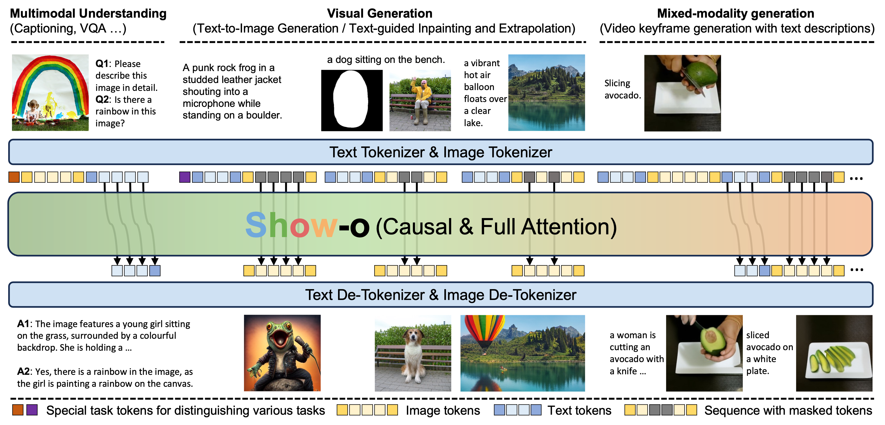

<div align="center">
<h1><font color=#6FA8DC>S</font><font color=#6FB150>h</font><font color=#E16766>o</font><font color=#F7B26B>w</font>-o</h1>
<h3>One Single Transformer to Unify Multimodal Understanding and Generation</h3>

[Jinheng Xie](https://sierkinhane.github.io/)<sup>1&#42;</sup>&nbsp;
[Weijia Mao](https://scholar.google.com/citations?hl=zh-CN&user=S7bGBmkyNtEC&view_op=list_works&sortby=pubdate)<sup>1&#42;</sup>&nbsp;
[Zechen Bai](https://www.baizechen.site/)<sup>1&#42;</sup>&nbsp;
[David Junhao Zhang](https://junhaozhang98.github.io/)<sup>1&#42;</sup>&nbsp;
<br>
Weihao Wang<sup>2</sup>&nbsp;
[Kevin Qinghong Lin](https://qinghonglin.github.io/)<sup>1</sup>&nbsp;
[Yuchao Gu](https://ycgu.site/)<sup>1</sup>
Zhijie Chen<sup>2</sup>&nbsp;
[Zhenheng Yang](https://scholar.google.com/citations?user=Ds5wwRoAAAAJ&hl=en)<sup>2</sup>&nbsp;
[Mike Zheng Shou](https://scholar.google.com/citations?hl=zh-CN&user=h1-3lSoAAAAJ&view_op=list_works&sortby=pubdate)<sup>1</sup> 

<sup>1</sup> Show Lab, National University of Singapore&nbsp; <sup>2</sup> Bytedance&nbsp;

[](https://arxiv.org/abs/2404.15909)

</div>



## News
* **[2024-04-24]** We release the inference code of Show-o for multimodal understanding and generation including image captioning, visual question answering (VQA), text-to-image generation, text-based inpaitning and extrapolation.

## TODO
- [X] Release the inference code.
- [ ] Release the training code (in the coming weeks).
- [ ] Scale up the model size (based on LLaMA3) and increase the number of training data.

## Getting Started
First, set up the environment:
```
pip3 install -r requirments.txt
```
Download all model checkpoints [here]() and put them to a directory in the structure below:
```
├── checkpoints/ 
|   ├── magvitv2.pth
|   ├── showo.bin
|   ├── showo_w_clip_vit.bin
```
Login your wandb account on your machine or server.
```
wandb login <your wandb keys>
```
Inference demo for **Multimodal Understanding** and you can view the results on wandb.
```
python3 inference_mmu.py config=configs/showo_demo_w_clip_vit.yaml \
mmu_image_root=./mmu_validation question=['Please describe this image in details.','What do you think is the main ingredient of this dish','Please tell me how to make this dish'] \
pretrained_model_path=./checkpoints/showo_w_clip_vit.bin
```
Inference demo for **Text-to-Image Generation** and you can view the results on wandb.
```
python3 inference_t2i.py config=configs/showo_demo.yaml \
batch_size=32 validation_prompts_file=validation_prompts/showoprompts.txt \
guidance_scale=1.75 generation_timesteps=16 \
mode='t2i' pretrained_model_path=./checkpoints/showo_w_clip_vit.bin
```
Inference demo for **Text-based Inpainting** and you can view the results on wandb.
```
python3 inference_t2i.py config=configs/showo_demo.yaml \
batch_size=32 \
guidance_scale=1.75 generation_timesteps=16 \
pretrained_model_path=./checkpoints/showo_w_clip_vit.bin \
mode='inpainting' prompt='A blue sports car with sleek curves and tinted windows, parked on a bustling city street.' \
image_path=./inpainting_validation/bus.jpg inpainting_mask_path=./inpainting_validation/bus_mask.webp
```
Inference demo for **Text-based Extrapolation** and you can view the results on wandb.
```
python3 inference_t2i.py config=configs/showo_demo.yaml \
batch_size=32 \
guidance_scale=1.75 generation_timesteps=16 \
pretrained_model_path=./checkpoints/showo_w_clip_vit.bin \
mode='extrapolation' extra_direction='left *** left *** left *** right *** right *** right' offset=0 prompt='a serene natural landscape featuring a clear, blue lake surrounded by lush green trees. *** a serene natural landscape featuring a clear, blue lake surrounded by lush green trees. *** a serene natural landscape featuring a clear, blue lake surrounded by lush green trees. *** a serene natural landscape featuring a clear, blue lake surrounded by lush green trees. *** a serene natural landscape featuring a clear, blue lake surrounded by lush green trees. *** a serene natural landscape featuring a clear, blue lake surrounded by lush green trees.' \
image_path=./inpainting_validation/alpine_lake.jpg```
```

### License
### Citation
To cite the paper, model, or software, please use the below:
```
@article{xie2024showo,
  title={Show-o: One Single Transformer to Unify Multimodal Understanding and Generation},
  author={},
  journal={},
  year={2024}
}
```
