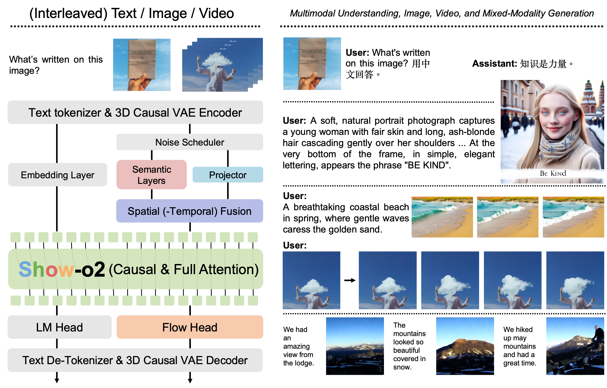
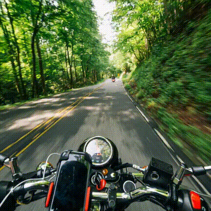
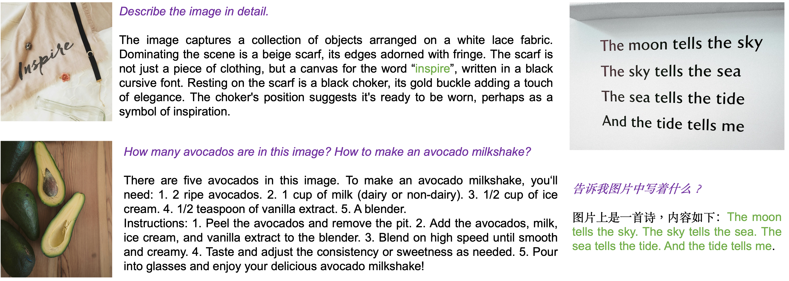

<div align="center">
<br>


[//]: # (<h3>Improved Unified Multimodal Models</h3>)

[Jinheng Xie](https://sierkinhane.github.io/)<sup>1</sup>&nbsp;
[Zhenheng Yang](https://scholar.google.com/citations?user=Ds5wwRoAAAAJ&hl=en)<sup>2</sup>&nbsp;
[Mike Zheng Shou](https://sites.google.com/view/showlab)<sup>1</sup> 

<sup>1</sup> [Show Lab](https://sites.google.com/view/showlab/home?authuser=0), National University of Singapore&nbsp; <sup>2</sup> Bytedance&nbsp;
 
[](https://arxiv.org/abs/2506.15564) [](https://github.com/showlab/Show-o/blob/main/docs/wechat_qa_3.jpg)
</div>

## News
* **[2025-06-19]** We release the Show-o2 models **with 1.5B and 7B LLM parameters** for multimodal understanding and generation.

## What is the new about Show-o2?
Below is an overview of **Show-o2**. We perform the unified learning of multimodal understanding and generation on the text token and **3D Causal VAE space**, which is scalable for **text, image, and video modalities**. A dual-path of spatial (-temporal) fusion is proposed to accommodate the distinct feature dependency  of multimodal understanding and generation. We employ specific heads with **autoregressive modeling and flow matching** for the overall unified learning of **multimodal understanding, image/video and mixed-modality generation.**

<br/>


<table style="width:100%;">
  <tr>
    <td style="width:50%;">
      
    </td>
    <td style="width:50%;">
      
    </td>
  </tr>
</table>

<table style="width:100%;">
  <tr>
    <td style="width:25%;">
      
    </td>
    <td style="width:25%;">
      
    </td>
    <td style="width:25%;">
      
    </td>
    <td style="width:25%;">
      
    </td>
  </tr>
</table>


## TODO
- [X] Release the models for single image-text understanding and generation.
- [X] Release the evaluation code.
- [ ] Release the training code.
- [X] Release the models supporting image generation in a higher resolution (512x512 and 1024x1024) with better text rendering.
- [ ] Release the models supporting mixed-modality generation.
- [ ] Release the models supporting image-to-video and text-to-video generation.

## Pre-trained Model Weigths
The Show-o2 checkpoints can be found on Hugging Face:
* [showlab/show-o2-1.5B](https://huggingface.co/showlab/show-o2-1.5B)
* [showlab/show-o2-1.5B-HQ](https://huggingface.co/showlab/show-o2-1.5B-HQ) (text-to-image generation in resolutions of 512x512 and 1024x1024 with better text rendering)
* [showlab/show-o2-7B](https://huggingface.co/showlab/show-o2-7B)

## Getting Started
First, set up the environment:
```
bash build_env.sh
```
Login your wandb account on your machine or server.
```
wandb login <your wandb keys>
```
Download Wan2.1 3D causal VAE model weight [here](https://huggingface.co/Wan-AI/Wan2.1-T2V-14B/blob/main/Wan2.1_VAE.pth) and put it on the current directory.

Demo for **Multimodal Understanding** and you can find the results on wandb.
```
python3 inference_mmu.py config=configs/showo2_7b_demo_432x432.yaml \
                         mmu_image_path=./docs/mmu/pexels-jane-pham-727419-1571673.jpg question='Describe the image in detail.'

python3 inference_mmu.py config=configs/showo2_7b_demo_432x432.yaml \
                         mmu_image_path=./docs/mmu/pexels-fotios-photos-2923436.jpg question='请告诉我图片中写着什么？'

python3 inference_mmu.py config=configs/showo2_7b_demo_432x432.yaml \
                         mmu_image_path=./docs/mmu/pexels-taryn-elliott-4144459.jpg question='How many avocados (including the halved) are in this image? Tell me how to make an avocado milkshake in detail.'
```


Demo for **Text-to-Image Generation** and you can find the results on wandb.
```
python3 inference_t2i.py config=configs/showo2_1.5b_demo_1024x1024.yaml \
                         batch_size=4 guidance_scale=7.5 num_inference_steps=50;
         
python3 inference_t2i.py config=configs/showo2_1.5b_demo_512x512.yaml \
                         batch_size=4 guidance_scale=7.5 num_inference_steps=50;
                                      
python3 inference_t2i.py config=configs/showo2_1.5b_demo_432x432.yaml \
                         batch_size=4 guidance_scale=7.5 num_inference_steps=50;

python3 inference_t2i.py config=configs/showo2_7b_demo_432x432.yaml \
                         batch_size=4 guidance_scale=7.5 num_inference_steps=50;
```


## Evaluation
### GenEval
```
# Generate images
bash evaluation/sample_geneval.sh

# Create an independent environment for GenEval (we use PyTorch 1.10.0)
git clone https://github.com/djghosh13/geneval.git
cd geneval
./evaluation/download_models.sh 'weights';
git clone https://github.com/open-mmlab/mmdetection.git
cd mmdetection; git checkout 2.x;
pip3 install -v -e .;
sudo pip3 install open-clip-torch;
sudo pip3 install clip-benchmark;
pip3 install -U openmim;
mim install mmcv-full;

# Evaluate
python3 evaluation/evaluate_images.py \
    "/path/to/your/generated/images" \
    --outfile "results.jsonl" \
    --model-path "./weights";
python3 evaluation/summary_scores.py "results.jsonl";
```
### DPG-Bench
```
# Generate images
bash evaluation/sample_dpg.sh

# Create an independent environment for DPG-Bench (we use PyTorch 2.5.1)
pip3 install modelscope==1.22.2; (if encountering issues, try modelscope==1.20.0)
pip3 install librosa==0.10.1
pip3 install git+https://github.com/One-sixth/fairseq.git
pip3 install opencv-python;
pip3 install unicodedata2;
pip3 install zhconv;
pip3 install rapidfuzz;
pip3 install numpy==1.23.5;
pip3 install addict;
pip3 install datasets==2.21.0;
pip3 install simplejson;
pip3 install sortedcontainers;

# Evaluate
cd evaluation;
bash dist_eval.sh /path/to/your/generated/images image_resolution
```

### Multimodal Understanding Benchmarks

Download and install [lmms-eval](https://github.com/EvolvingLMMs-Lab/lmms-eval) following their instructions.

[Download, add, replace some codes of lmms-eval](https://drive.google.com/file/d/1R9b5S1A0yYrcH7P-iiZc9XqG3B2SFKKn/view?usp=sharing) and structure them as follows:
```
├── lmms-eval/ 
|   ├── models
|   |   ├—— showo2_utils
|   |   ├—— ...
|   ├── __init__.py
|   ├── showo2_qwen2_5.py
|   ├── ...
```
``` 
# Evaluate
python3 -m accelerate.commands.launch --main_process_port 24348 \
    --num_processes=8 \
    -m lmms_eval \
    --model showo2_qwen2_5 \
    --model_args "config_file=/path/to/configs/showo2_7b_demo_432x432.yaml"  \
    --tasks mme,gqa,seedbench,mmbench,mmmu_val,mmstar,ai2d \
    --batch_size 1 \
    --log_samples \
    --log_samples_suffix showo2_qwen2_5 \
    --output_path ./logs/
```


### Citation
To cite the paper and model, please use the below:
```
@article{xie2025showo2,
  title={Show-o2: Improved Native Unified Multimodal Models},
  author={Xie, Jinheng and Yang, Zhenheng and Shou, Mike Zheng},
  journal={arXiv preprint arXiv:2506.15564},
  year={2025}
}

@article{xie2024showo,
  title={Show-o: One Single Transformer to Unify Multimodal Understanding and Generation},
  author={Xie, Jinheng and Mao, Weijia and Bai, Zechen and Zhang, David Junhao and Wang, Weihao and Lin, Kevin Qinghong and Gu, Yuchao and Chen, Zhijie and Yang, Zhenheng and Shou, Mike Zheng},
  journal={arXiv preprint arXiv:2408.12528},
  year={2024}
}
```
### Acknowledgments
This work is heavily based on [Show-o](https://github.com/showlab/show-o).
